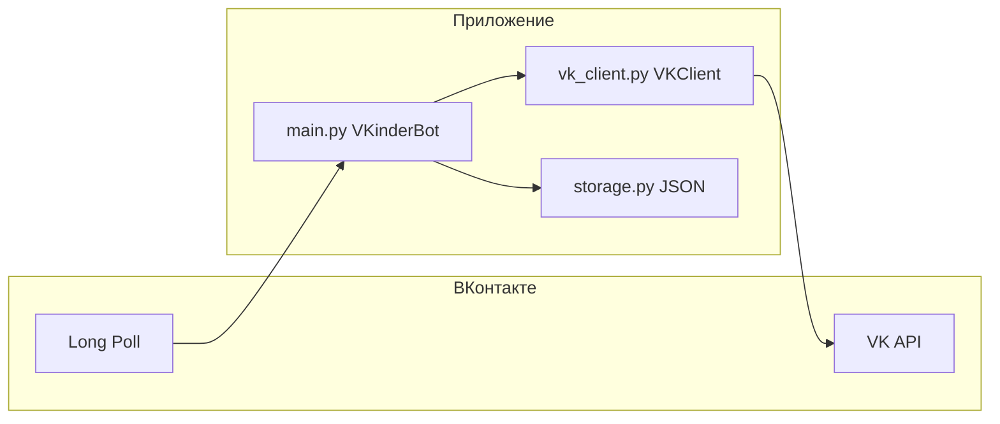

# VKinder — учебный VK-бот на Python

Бот **VKinder** помогает пользователю ВКонтакте просматривать анкеты других людей по простым правилам (пол противоположный вашему, город и возраст из профиля), сохранять понравившихся в **избранное** и скрывать нежелательных в **чёрный список**. Проект рассчитан на обучение: в коде и в этом файле разобраны основные идеи VK API и типичная архитектура бота для сообщества.

---

## Содержание

1. [Что умеет бот](#что-умеет-бот)
2. [Как устроены VK-боты](#как-устроены-vk-боты-краткий-учебник)
3. [Архитектура этого проекта](#архитектура-этого-проекта)
4. [Разбор файлов и потока данных](#разбор-файлов-и-потока-данных)
5. [Настройка ВКонтакте и запуск](#настройка-вконтакте-и-запуск)
6. [Переменные окружения](#переменные-окружения)
7. [Зависимости и команды](#зависимости-и-команды)
8. [Ограничения и доработки](#ограничения-и-доработки)

---

## Что умеет бот


| Возможность             | Описание                                                                                                                                           |
| ----------------------- | -------------------------------------------------------------------------------------------------------------------------------------------------- |
| **Поиск кандидатов**    | По нажатию «Далее» (или текстам `next`, `дальше`, `ещё`, `далее`) бот запрашивает людей через `users.search` с фильтрами из **вашего** профиля ВК. |
| **Карточка**            | Имя, возраст (из даты рождения в профиле), город, ссылка на страницу и до трёх фото из альбома «Фотографии на странице».                           |
| **Избранное**           | Сохранение текущего кандидата в файл `favorites.json` с датой добавления.                                                                          |
| **Чёрный список**       | Аналогично в `blacklist.json`; такие пользователи не попадают в выдачу при следующих поисках.                                                      |
| **Список избранного**   | Кнопка «Избранное» или команда `/favorites` — текстовый список (до 50 записей за раз).                                                             |
| **Подсказка по городу** | Если в профиле не указан город, бот один раз напоминает указать его для лучшей выдачи.                                                             |
| **Смена города**        | Если пользователь сменил город в профиле во время просмотра очереди, список кандидатов сбрасывается и подбирается заново.                          |
| **Служебные команды**   | `/help` — справка; `/test_search` — проверка доступа к поиску пользователей.                                                                       |


Клавиатура под полем ввода (persistent keyboard) фиксируется в коде и не требует от пользователя вводить команды вручную.

---

## Как устроены VK-боты

### Сообщество и бот

Чтобы бот отвечал от имени **группы** (сообщества), нужно:

1. Создать сообщество ВК.
2. Включить **Сообщения сообщества** и при необходимости настроить приветствие.
3. В разделе **Управление → Работа с API** создать **ключ доступа** с правами на сообщения (и другие нужные методы).

Дальше приложение должно **получать входящие сообщения** и **отправлять ответы** через API.

### Два способа получать новые сообщения

1. **Long Poll (Bots Long Poll)** — ваш сервер долго держит соединение с серверами VK и периодически получает пачку событий. Удобно для скрипта на своей машине или VPS. В этом проекте используется именно он (`VkBotLongPoll` из библиотеки `vk_api`).
2. **Callback API** — VK делает HTTP POST на **ваш URL** при событии. Нужен публичный HTTPS-сервер (или туннель вроде ngrok для отладки). Логика обработки та же, меняется только «транспорт».

Оба варианта приводят к одному: вы получаете объект события (например, новое сообщение), извлекаете `from_id` и текст, решаете, что ответить, вызываете `messages.send`.

### Почему в проекте два токена


| Токен                         | Роль                                                                                                                                                       |
| ----------------------------- | ---------------------------------------------------------------------------------------------------------------------------------------------------------- |
| **Токен сообщества (группы)** | Отправка сообщений пользователям от имени группы (`messages.send`), Long Poll для **бота** сообщества.                                                     |
| **Пользовательский токен**    | Методы вроде `users.search` и расширенный доступ к `users.get` / `photos.get` в учебных сценариях часто требуют прав **пользователя**, а не только группы. |


В коде класс `VKClient` явно разделяет сессии: `group_session` / `group_api` для сообщений и опроса, `user_session` / `user_api` для поиска и данных профилей.

Важно: пользовательский токен должен принадлежать аккаунту с достаточными правами и не попадать в публичные репозитории. Храните его только в `.env` или в секретах окружения.

### Основные методы API в этом боте

- `users.get` — профиль пользователя (пол, дата рождения, город), чтобы построить параметры поиска.
- `users.search` — поиск людей по полу, городу, возрасту, наличию фото.
- `photos.get` — фотографии из альбома профиля; в коде сортировка по лайкам, показ до трёх штук.
- `messages.send` — ответ в личку; для вложений используется строка вида `photo{owner_id}_{photo_id}`.
- `groups.getById` — узнать числовой `group_id` для инициализации Long Poll.

Официальная документация: [dev.vk.com](https://dev.vk.com/ru/reference).

### Случайный идентификатор при отправке

VK требует параметр `random_id` (или client-side уникальность), чтобы не дублировать сообщения при повторной отправке. В `main.py` для этого используется `random.randrange`.

### Клавиатура

`VkKeyboard` формирует JSON, который передаётся в `messages.send` как параметр `keyboard`. Кнопки дают пользователю текст, который приходит в том же чате как обычное сообщение — его можно распознавать по тексту (в т.ч. после нормализации).

---

## Архитектура этого проекта




- **Точка входа:** `main.py` — цикл Long Poll, маршрутизация текста сообщений, состояние сессии в памяти.
- **Работа с API:** `vk_client.py` — токены, вызовы методов, разбор возраста из `bdate`.
- **Долговременные данные:** `storage.py` — два JSON-файла, атомарная запись через временный файл и `os.replace`.

---

## Разбор файлов и потока данных

### `main.py` — логика бота

1. `**normalize_text`** — приводит текст к нижнему регистру и убирает лишние символы, чтобы совпадали и кнопки, и ручной ввод (в т.ч. с эмодзи в подписи кнопки).
2. `**get_keyboard` / `KEYBOARD**` — одна общая клавиатура на все ответы, где это нужно.
3. `**VKinderBot**`
  - При старте получает `group_id` через `groups.getById` и создаёт `VkBotLongPoll`.
  - `**listen**` — бесконечный цикл `for event in self.longpoll.listen()`.
  - `**handle_message**` — ветвление: далее / избранное / чёрный список / избранное списком / приветствие / `/help` / `/test_search`.
4. `**user_state**` — словарь по `user_id`: очередь кандидатов, индекс, параметры последнего поиска, текущий кандидат, множество исключённых id, флаг «подсказка про город уже была».
5. `**_build_search_params**` — из профиля пользователя: противоположный пол (`OPPOSITE_SEX`), `city_id`, возраст ±5 лет (с нижней границей не младше 18).
6. `**_handle_next**` — подгружает партию кандидатов (`find_candidates`), вычитает избранное и чёрный список, пропускает анкеты без доступных фото, шлёт карточку.
7. `**_handle_favorite` / `_handle_blacklist**` — проверяют, что есть `current_candidate`, пишут в storage, обновляют `excluded_ids`, показывают следующего кандидата.

Так вы разделяете **транспорт** (Long Poll + send), **доменную логику** (кого показывать, в каком порядке) и **хранилище** (JSON).

### `vk_client.py` — обёртка над VK API

- Загрузка `.env` через `load_dotenv()`.
- Два `VkApi`-сеанса и два объекта `get_api()`.
- `**parse_age_from_bdate`** — парсит строку `ДД.ММ.ГГГГ`; если дата неполная (как часто бывает в ВК), возраст не считается.
- `**find_candidates**` — собирает словарь параметров для `users.search` (`has_photo=1`, поля `bdate,city,sex`).

Ошибки `photos.get` перехватываются: при недоступности альбома возвращается пустой список, и бот просто пропускает такого кандидата.

### `storage.py` — файлы рядом с проектом

- `**favorites.json**` и `**blacklist.json**` — списки объектов с полями кандидата плюс `owner_id` (кто добавил) и `added_at`.
- `**_save_json**` — запись во временный файл и `os.replace`, чтобы при сбое не оставить обрезанный JSON.

---

## Настройка ВКонтакте и запуск

### 1. Сообщество

- Создайте группу, включите сообщения.
- **Сообщения → Настройки для бота** — можно включить возможности бота (по желанию ВК).
- Создайте ключ с доступом к сообщениям (и Long Poll для сообщений сообщества).

### 2. Права пользовательского токена

Для `users.search` и просмотра данных других пользователей пользовательский токен должен быть получен с нужными scope (набор прав при авторизации через OAuth или другой допустимый способ для вашего сценария). Точный набор прав зависит от политики VK и типа приложения — сверяйтесь с [документацией метода](https://dev.vk.com/ru/method/users.search).

### 3. Установка и запуск

```bash
cd /path/to/vk-bot
python3 -m venv .venv
source .venv/bin/activate   # Windows: .venv\Scripts\activate
pip install -r requirements.txt
```

Создайте файл `.env` в корне проекта (см. следующий раздел) и выполните:

```bash
python main.py
```

Процесс должен работать постоянно, пока вы хотите принимать сообщения (на своём ПК, сервере или в фоне через systemd/supervisor).

---

## Переменные окружения

Файл `.env` (не коммитьте в git):

```env
VK_USER_TOKEN=...   # пользовательский access_token
VK_GROUP_TOKEN=...  # токен сообщества (группы)
```

Имена переменных заданы в `vk_client.py`: при отсутствии любой из них конструктор `VKClient` выбросит понятную ошибку.

---

## Зависимости и команды


| Пакет           | Назначение                                                                                                                          |
| --------------- | ----------------------------------------------------------------------------------------------------------------------------------- |
| `vk_api`        | Обертка над VK API, Long Poll бота, клавиатуры                                                                                      |
| `python-dotenv` | Загрузка переменных из `.env`                                                                                                       |
| `pytest`        | Фреймворк тестов (в репозитории можно добавить `tests/` и проверять чистые функции вроде `parse_age_from_bdate` и `normalize_text`) |


```bash
pip install -r requirements.txt
pytest          # когда появятся тесты
```

---

## Ограничения и доработки

- **Состояние в памяти** — после перезапуска бота очередь кандидатов для каждого пользователя сбрасывается (избранное и ЧС остаются в файлах).
- **Глобальные JSON** — избранное и чёрный список общие на всех пользователей бота; для продакшена чаще делают разбиение по `owner_id` или базу данных.
- **Лимиты API** — у методов VK есть ограничения по частоте запросов; при росте нагрузки нужны очереди, кэш и аккуратный `offset` при повторных поисках.
- **Приватность** — бот опирается на открытые данные и доступность фото; часть профилей может быть закрыта.

---

## Краткая шпаргалка

1. Сообщество + токен группы → сообщения и Long Poll.
2. Отдельный пользовательский токен → поиск и часть чтения данных.
3. Цикл: событие → разбор текста → изменение состояния → `messages.send`.
4. Вынесите API в отдельный класс, данные — в отдельный модуль, как в этом репозитории — так проще тестировать и расширять функциональность.

